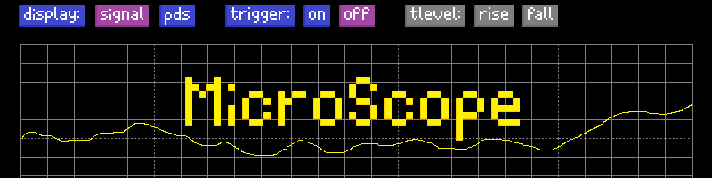

# MicroScope: STM32F429I-Discovery Oscilloscope

MicroScope is a simple oscilloscope project for the STM32F429I-Discovery board. It samples analog signals, performs FFT analysis, and displays waveforms and spectra on the onboard LCD.

## Features
- Real-time signal acquisition
- FFT analysis
- LCD plotting
- FreeRTOS-based multitasking

## Hardware Requirements
- STM32F429I-Discovery board
- Signal source (function generator, etc.)

## Getting Started
1. Clone this repository:
   ```sh
   git clone https://github.com/kadukes/MicroScope.git
   ```
2. Open the project in STM32CubeIDE.
3. Build and flash to your STM32F429I-Discovery board.

## Directory Structure
- `Core/` - Main application code
- `Drivers/` - Board support and peripheral drivers
- `Middlewares/` - Third-party libraries (FreeRTOS)
- `Resources/` - Images and other resources
- `Utilities/Fonts/` - LCD font files

## License
This project is licensed under the MIT License. See [LICENSE](LICENSE.md) for details.
